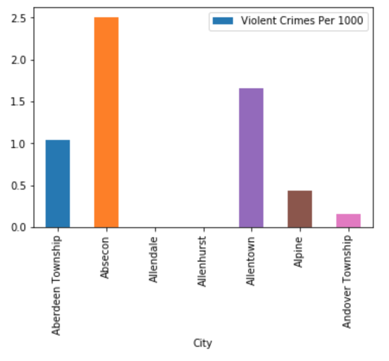

slidenumbers: true
footer: brianstempin.com 🐍

# Ruling Life with PANDAS
### Because it needed to be done!

---

# What is Pandas?

From their website:

> pandas is an open source, BSD-licensed library providing high-performance, easy-to-use data structures and data analysis tools for the Python programming language.

---

# Say Hwat Now?


---

# But Seriously

You can do some really cool stuff with 1, 2, and 3 dimentional data.  Most of this presentation will focus on 2d (table) data.

---

# Why do I Need This Crap?

Let's pretend that you have the following array of rows to process:

```python
# City, Population, Violent Crimes, Murders, Roberies, Aggrevated Assaults
rows = [
['Aberdeen Township', 18150, 19, 0, 13, 6],
['Absecon', 8380, 21, 0, 4, 15],
['Allendale', 6712, 0, 0, 0, 0],
['Allenhurst', 493, 0, 0, 0, 0],
['Allentown', 1812, 3, 0, 0, 3],
['Alpine', 2314, 1, 0, 0, 1],
['Andover Township', 6273, 1, 0, 0, 1],
]
```

---

# Let's Ask a Few Questions

1.  How many violent crimes are there per 1,000 citizens?
2.  What percentage of violent crimes were aggrevated assaults?
3.  How many violent crimes are there per 1,000 citizens per city?

---

# Let's Try Answering Without Pandas

```python
# ansering question one - get the sum of all citizens, the sum of all violent crimes, calculate the ratio, and multiply by 1000

sum_people = 0
sum_violent_crimes = 0
for row in rows:
	sum_people += row[1]
	sum_violent_crimes += row[2]
	
violent_crimes_ratio = sum_violent_crimes / sum_people
violent_crimes_per_thousand_people = violent_crimes_ratio * 1000
```

This isn't the worst...

---

# Let's Try the Second One

```python
# Similar to the last example, we'll get the sum of all violent crimes, the sum of all aggrevated assaults, and divide the two

sum_aggrevated_assaults = 0
sum_violent_crimes = 0
for row in rows:
	sum_aggrevated_assaults += row[5]
	sum_violent_crimes += row[2]
	
aggrevated_assault_ratio = sum_aggrevated_assaults / sum_violent_crimes
```

No worse than the last one, but it's not great.  We can imagine how this might get out of hand.

---

# Cool.  How About That Last One?

```python

violent_crimes_per_1k_people_per_city = list()
for row in rows:
	result_row = [row[0], 1000 * row[2] / row[1]]
	violent_crimes_per_1k_people_per_city(result_row)
```

I think we're starting to see that this might get messy if we're using tables to build other tables.

---

# Pandas Time!

```python
import pandas as pd
	
df = pd.DataFrame.from_records(rows, columns=['City', 'Population', 'Violent Crimes', 'Murders', 'Roberies', 'Aggrevated Assaults'])

# Question one
violent_crimes_per_thousand_people = 1000 * df['Violent Crimes'].sum() / df['Population'].sum()

# Question two
aggrevated_assault_ratio = df['Aggrevated Assaults'].sum() / df['Violent Crimes'].sum()

# Question three
stats_per_city = df.groupby('City').sum()
stats_per_city['Violent Crimes Per 1000'] = 1000 * stats_per_city['Violent Crimes'] / stats_per_city['Population']
```

That's...odly satisfying.

---

# Watch This Get Good!

```python
# Generate graph
import matplotlib.pyplot as plt

stats_per_city.plot(y='Violent Crimes Per 1000', kind='bar')
```


---

# Let's Talk About What we Just Did

Some basic vocalulary:

* `Series`:  A column of data; kind of like an array; elements are generally of the same type.
* `DataFrame`:  A collection of `Series` (columns); may also have some index and some naming.

---

# Let's Talk About What we Just Did


```python
df = pd.DataFrame.from_records(rows, columns=['City', 'Population', 'Violent Crimes', 'Murders', 'Roberies', 'Aggrevated Assaults'])
```

This snippet is a `DataFrame` constructor.  It takes a 2d array (arranged as rows) and translates it into a `DataFrame` (under the covers, it's really a bunch of `Series` columns) and adds some metadata (in this case, the column names).

---

# Common Point of Confusion:  Row vs Column Orientation

We're generally used to thinking of data as rows:

```python
# City, Population, Violent Crimes, Murders, Roberies, Aggrevated Assaults
rows = [
['Aberdeen Township', 18150, 19, 0, 13, 6],
['Absecon', 8380, 21, 0, 4, 15],
['Allendale', 6712, 0, 0, 0, 0],
['Allenhurst', 493, 0, 0, 0, 0],
['Allentown', 1812, 3, 0, 0, 3],
['Alpine', 2314, 1, 0, 0, 1],
['Andover Township', 6273, 1, 0, 0, 1],
]
```

---

# Common Point of Confusion:  Row vs Column Orientation

Pandas does the opposite.  Here's how the same data would look if it were column-oriented:

```python
# City, Population, Violent Crimes, Murders, Roberies, Aggrevated Assaults
columns = [
['Aberdeen Township', 'Absecon', 'Allendale', 'Allenhurst', 'Allentown''Alpine', 'Andover Township'],
[18150, 8380, 6712, 493, 1812, 2314, 6273],
[19, 21, 0, 0, 3, 1, 1],
[0, 0, 0, 0, 0, 0, 0],
[13, 4, 0, 0, 0, 0, 0],
[6, 15, 0, 0, 3, 1, 1],
]
```

---

# Selecting Data

Even though `DataFrame`s are not the base unit of functionality in Pandas, we've started with them because they're the most useful. Here are a few ways to select data from them.  We'll need this to talk about `Series` operations.

```python

# Selecting a single series from a DF
population_series = df['Population']

# Selecting multiple series from a DF, creating a sub-df
sub_df = df[['Population', 'Violent Crimes']]
```

---

# Common Series Operations

In Pandas, a `Series` is the "lowest dimension."  There are a whole collections of functions you can use on them.  You can also ask Pandas to do operations between them.  

See the `02_common_series_operations` notebook for a bunch of examples.

```python
# Gets the sum of the population
df['Population'].sum()

# Gets the sum of the murders and the roberies for each city
df['Murders'] + df['Roberies']
```
---

# Common DataFrame Operations

As stated earlier, a DF is a collection of `Series` and some extra metadata.  Just like with the `Series`, there are a whole host of functions you can run on them.  You can also filter, transpose, and do all other kinds of neat things.

See the `03_common_dataframe_operations` notebook for a bunch of examples.

```python
# You could sum an entire df if you wanted
df.sum()
```

---

# Exercise Time

This is the part where you get to really kick the tires.  I'm going to throw a dataset similar to the one that we've been working with and try to throw some questions at you.

Check out the `04_exercise` notebook for the exercise.